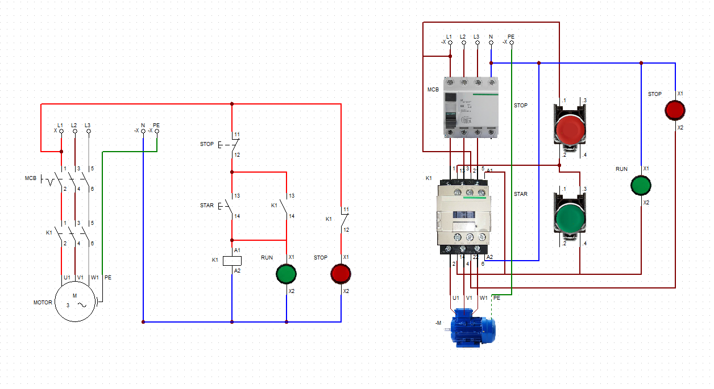

# ⚡ Simulasi Direct On Line (DOL) Motor Starter Menggunakan CADe_SIMU

## Deskripsi

Project ini merupakan simulasi rangkaian **Direct On Line (DOL) Motor Starter** menggunakan software **CADe_SIMU**. Simulasi dibuat untuk mempelajari prinsip kerja sistem pengendalian motor induksi tiga fasa, mulai dari rangkaian daya (Power Circuit), rangkaian kontrol (Control Circuit), hingga visualisasi tata letak komponen.

Project ini bertujuan untuk memahami cara kerja kontaktor, push button, serta sistem self-holding pada rangkaian kontrol motor yang umum digunakan di dunia industri.

---

## Tujuan Project

- Mempelajari prinsip kerja Direct On Line (DOL) Motor Starter.
- Mendesain dan mensimulasikan rangkaian daya dan rangkaian kontrol.
- Memahami fungsi setiap komponen pada sistem kontrol motor.
- Melatih kemampuan dalam membaca dan membuat wiring diagram.
- Menyusun dokumentasi sebagai portofolio pembelajaran.

---

## Software yang Digunakan

- CADe_SIMU

---

## Komponen yang Digunakan

- MCB 3 Pole
- Magnetic Contactor
- Push Button START (NO)
- Push Button STOP (NC)
- Kontak Bantu (Auxiliary Contact)
- Lampu Indikator RUN
- Lampu Indikator STOP
- Motor Induksi 3 Fasa
- Terminal Block

---

## Isi Repository

Repository ini berisi:

- 🔌 Diagram Power Circuit
- ⚙️ Diagram Control Circuit
- 🖼️ Layout komponen
- 🎥 Video simulasi

---

## Cara Kerja Sistem

1. MCB diaktifkan sehingga rangkaian mendapatkan sumber tegangan.
2. Tombol **START** ditekan untuk mengaktifkan coil kontaktor.
3. Kontak bantu (Auxiliary Contact) melakukan self-holding sehingga kontaktor tetap aktif meskipun tombol START dilepas.
4. Kontak utama kontaktor menyalurkan tegangan tiga fasa ke motor sehingga motor mulai beroperasi.
5. Lampu indikator **RUN** menyala sebagai tanda motor sedang berjalan.
6. Saat tombol **STOP** ditekan, coil kontaktor kehilangan tegangan sehingga kontaktor kembali ke posisi normal.
7. Motor berhenti dan lampu indikator **STOP** menyala.

---

## Hasil Simulasi

Simulasi berhasil menunjukkan prinsip kerja Direct On Line (DOL) Motor Starter, mulai dari proses start, self-holding, hingga penghentian motor menggunakan tombol STOP. Project ini dapat digunakan sebagai media pembelajaran dasar mengenai sistem kontrol motor listrik.

---

## Kompetensi yang Ditunjukkan

- Motor Control Circuit
- Electrical Wiring Diagram
- Electrical Control System
- Industrial Electrical
- CADe_SIMU
- Electrical Troubleshooting
- Electrical Documentation

---

## Dokumentasi

---

## Dibuat Oleh

**Eldoni Purba**

Portofolio Electrical Engineering
