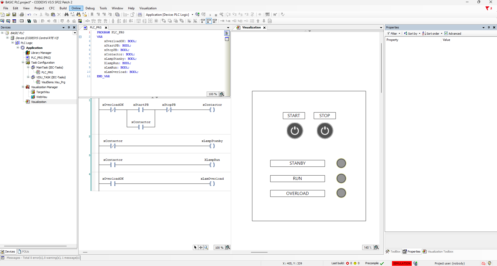
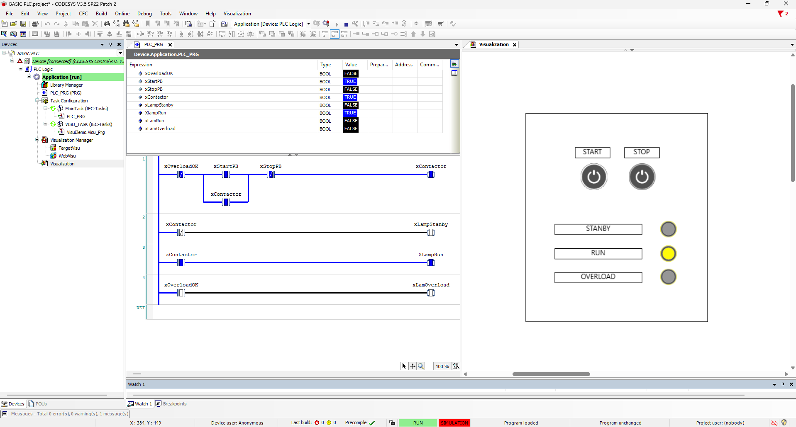

# PLC DOL Motor Starter (CODESYS)

## Overview

This project demonstrates the implementation of a **Direct-On-Line (DOL) Motor Starter** using **CODESYS PLC** programmed in **Ladder Diagram (LD)**. The system includes Start/Stop control, self-holding (seal-in) logic, overload protection, and a simple HMI visualization for monitoring motor status.

---

## Features

- Start Push Button
- Stop Push Button
- Self-Holding (Seal-In) Circuit
- Overload Protection
- Standby Indicator
- Run Indicator
- Overload Indicator
- HMI Visualization
- PLC Simulation using CODESYS

---

## Software

- CODESYS V3
- Ladder Diagram (LD)

---

## I/O List

### Inputs

| Variable | Description |
|----------|-------------|
| `xStartPB` | Start Push Button |
| `xStopPB` | Stop Push Button |
| `xOverloadOK` | Overload Status |

### Outputs

| Variable | Description |
|----------|-------------|
| `xContactor` | Motor Contactor Coil |
| `xLampStandby` | Standby Indicator |
| `xLampRun` | Run Indicator |
| `xLampOverload` | Overload Indicator |

---

## Operating Principle

1. Press the **Start** button to energize the motor contactor.
2. The motor remains energized through the **self-holding (seal-in)** circuit.
3. Press the **Stop** button to stop the motor.
4. If an **overload** condition occurs, the contactor is de-energized and the overload indicator turns on.
5. Motor status is displayed through the HMI visualization.

---

## Simulation Result

- ✅ Start/Stop control operates correctly.
- ✅ Self-holding logic functions as expected.
- ✅ Overload protection interrupts the motor circuit.
- ✅ HMI displays Standby, Run, and Overload status in real time.

---

## Project Screenshots

### Ladder Diagram - HMI

### Online Simulation

---

## Learning Outcomes

- PLC programming using Ladder Diagram (LD)
- Direct-On-Line (DOL) motor control
- PLC simulation with CODESYS
- HMI design and visualization
- Industrial motor control fundamentals

---

## Author

**Eldoni Tuah Rito Purba**

Electrical Engineer | Industrial Automation Enthusiast
